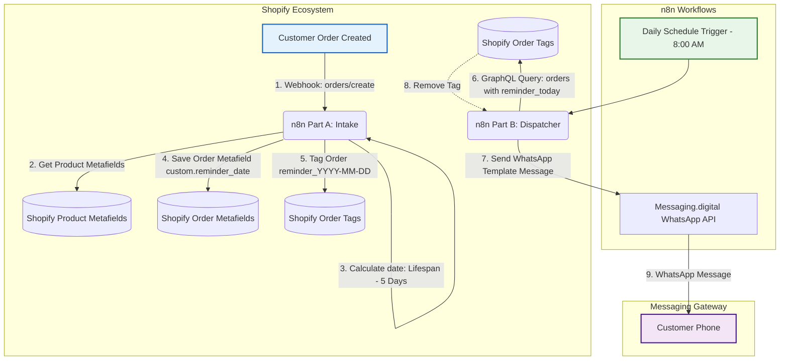
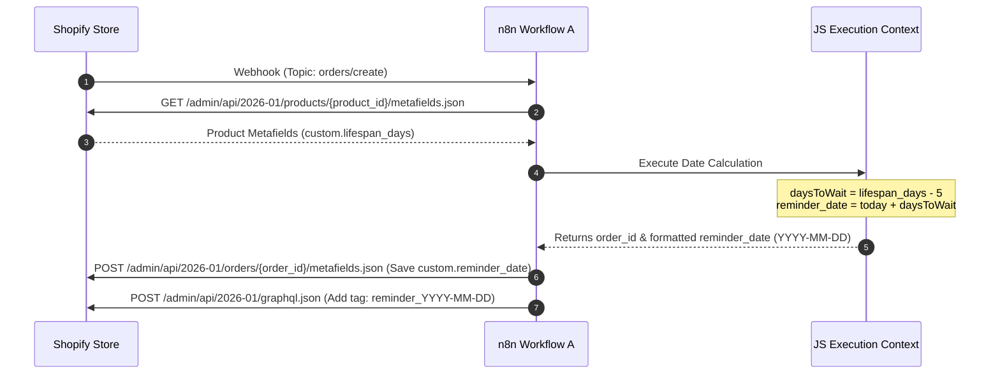
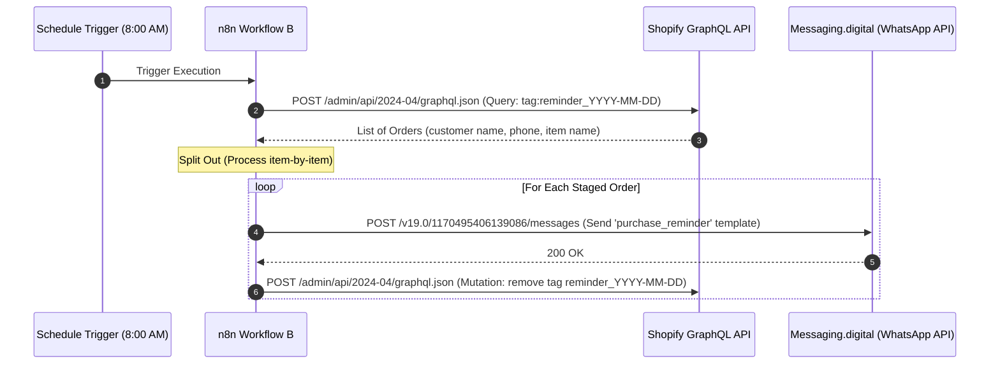

# Naturavest WhatsApp Automation Architecture

This document provides a comprehensive architectural overview of the **Naturavest Product End Reminder System**. The system consists of two n8n workflows designed to track product lifespans from customer orders and automatically send a WhatsApp reminder to customers 5 days before their product is estimated to run out.

---

## System Overview

The system is decoupled into two asynchronous phases:
1. **Phase A (Order Intake & Scheduling):** Real-time ingestion of new orders to calculate and record the target reminder date on Shopify.
2. **Phase B (Daily Dispatch & Cleanup):** A cron-scheduled worker that query-filters today's reminder-due orders, sends WhatsApp notifications, and clears the pending reminder state.

---

## Detailed Component Architecture

### Part A: Order Calculation & Shopify Sync (Real-time Webhook)
**Workflow File:** [Naturavest - Product End Reminder - 1a (Calculate Date & Save to Shopify).json](Naturavest%20-%20Product%20End%20Reminder%20-%201a%20(Calculate%20Date%20&%20Save%20to%20Shopify).json)

This workflow triggers immediately when a new order is placed.

#### Step-by-Step Execution Block
1. **Shopify Trigger:** Subscribes to `orders/create` webhook.
2. **HTTP Request 1 (Fetch Lifespan):** Queries the Shopify REST API for the first line item's product metafields.
3. **JavaScript Code:** 
   - Searches the product's metafields for `custom.lifespan_days`.
   - Defaults to `30` days if undefined to ensure system resilience.
   - Calculates the target notification date: `Reminder Date = Today + (Lifespan Days - 5)`.
   - Prepares the payload containing the formatted date (`YYYY-MM-DD`) and `order_id`.
4. **HTTP Request 2 (Save Metafield):** Commits the calculated `reminder_date` back to the Shopify order under namespace `custom`, key `reminder_date`.
5. **HTTP Request 3 (Add Tag):** Executes a GraphQL mutation to tag the order with `reminder_YYYY-MM-DD` (e.g. `reminder_2026-08-15`).

---

### Part B: Daily Reminders & Cleanup (Cron Job)
**Workflow File:** [Naturavest - Product End Reminder - 1b (Send WhatsApp & Tag Order).json](Naturavest%20-%20Product%20End%20Reminder%20-%201b%20(Send%20WhatsApp%20&%20Tag%20Order).json)

This workflow operates once daily at 8:00 AM to process all reminders due on that calendar day.

#### Step-by-Step Execution Block
1. **Schedule Trigger:** Configured to execute daily at 08:00 AM local time.
2. **Get Today's Orders:** Sends a GraphQL query to Shopify searching for up to 50 orders matching query: `tag:reminder_{{ $today.toISODate() }}`.
3. **Split Out:** Splinters the order collection array into separate execution threads so each recipient is processed independently.
4. **WhatsApp Dispatch (HTTP Request):** Invokes the Messaging.digital WhatsApp API endpoint to deliver a WhatsApp template named `purchase_reminder`.
   - **Recipient:** Cleans and formats phone numbers by stripping non-digit characters (`replace(/\D/g, '')`). First checks the order phone, then falls back to the customer account phone.
   - **Template Parameters:** Dynamic mapping of the customer's first name (default: `'there'`) and the purchased product's title (default: `'your product'`).
5. **Remove Tag (HTTP Request 1):** Executes a GraphQL mutation to untag the order, ensuring the customer does not receive redundant notifications on subsequent runs.

---

## Data Schema & API Definitions

### 1. Shopify Metadata & Tags
* **Product Custom Metafield:**
  - Namespace: `custom`
  - Key: `lifespan_days`
  - Type: `Integer`
  - Purpose: Tracks total lifecycle days of the product (e.g. 30, 60, 90).
* **Order Custom Metafield:**
  - Namespace: `custom`
  - Key: `reminder_date`
  - Type: `date`
  - Format: `YYYY-MM-DD`
  - Purpose: Audit trail representing when the reminder was scheduled to fire.
* **Order Tag:**
  - Format: `reminder_YYYY-MM-DD`
  - Purpose: Used for highly efficient indexed querying in GraphQL during Part B.

### 2. WhatsApp API Integration
* **API Vendor:** Messaging.digital (`messagingapi.charteredinfo.com`)
* **Method:** `POST`
* **Template Name:** `purchase_reminder`
* **Language:** `en` (English)
* **Body Parameters:**
  1. `{{1}}`: Customer First Name
  2. `{{2}}`: Product Title
