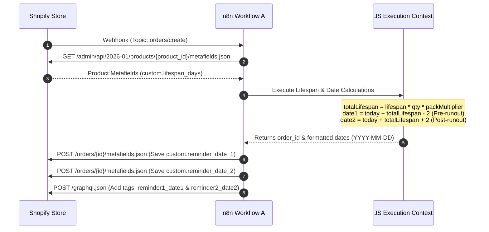
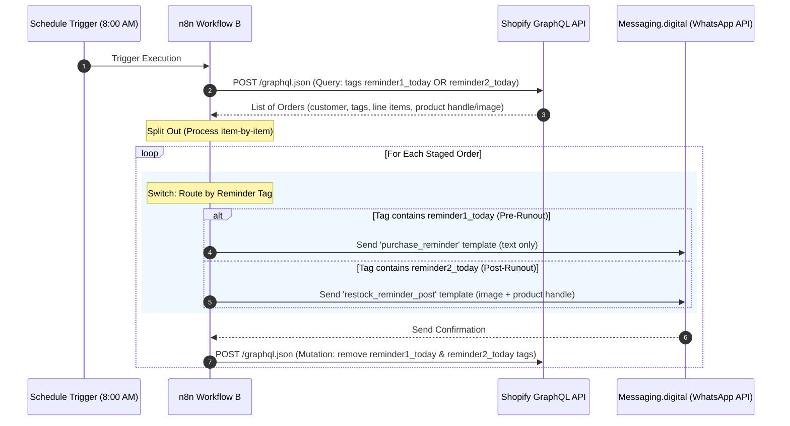

# Naturavest WhatsApp Automation Architecture

This document provides a comprehensive architectural overview of the **Naturavest Product End Reminder System**. The system consists of two n8n workflows designed to track product lifespans from customer orders and automatically send two stages of WhatsApp reminders to customers: a **Pre-Runout Reminder** (2 days before estimated runout) and a **Post-Runout Restock Reminder** (2 days after estimated runout).

---

## System Overview

The system is decoupled into two asynchronous phases:
1. **Phase A (Order Intake & Scheduling):** Real-time ingestion of new orders to calculate total product lifespan (considering quantities and pack multipliers), and record the two target reminder dates on Shopify.
2. **Phase B (Daily Dispatch & Cleanup):** A cron-scheduled worker that query-filters orders due for either of the two reminders today, routes them to send the appropriate WhatsApp template, and clears the pending reminder tags.

```mermaid
graph TD
    subgraph Shopify Ecosystem
        A[Customer Order Created] -->|1. Webhook: orders/create| B(n8n Part A: Intake)
        B -->|2. Get Product Metafields| C[(Shopify Product Metafields)]
        B -->|4. Save Metafield custom.reminder_date_1| D[(Shopify Order Metafields)]
        B -->|5. Save Metafield custom.reminder_date_2| D[(Shopify Order Metafields)]
        B -->|6. Tag Order reminder1_YYYY-MM-DD & reminder2_YYYY-MM-DD| E[(Shopify Order Tags)]
        H[(Shopify Order Tags)] -.-->|9. Remove Tags| G
    end

    subgraph n8n Workflows
        B -->|3. Calculate dates based on quantity & packs| B
        F[Daily Schedule Trigger - 8:00 AM] --> G(n8n Part B: Dispatcher)
        G -->|7. GraphQL Query: orders with reminder1_today or reminder2_today| H[(Shopify Order Tags)]
        G -->|8. Route and Send WhatsApp Template| I[Messaging.digital WhatsApp API]
    end

    subgraph Messaging Gateway
        I -->|10. WhatsApp Message| J[Customer Phone]
    end

    style A fill:#e3f2fd,stroke:#1565c0,stroke-width:2px
    style F fill:#e8f5e9,stroke:#2e7d32,stroke-width:2px
    style J fill:#f3e5f5,stroke:#4a148c,stroke-width:2px
```

---

## Detailed Component Architecture

### Part A: Order Calculation & Shopify Sync (Real-time Webhook)
**Workflow File:** [Naturavest - Product End Reminder - 1a (Calculate Date & Save to Shopify).json](Naturavest%20-%20Product%20End%20Reminder%20-%201a%20(Calculate%20Date%20&%20Save%20to%20Shopify).json)

This workflow triggers immediately when a new order is placed.



#### Step-by-Step Execution Block
1. **Shopify Trigger:** Subscribes to `orders/create` webhook.
2. **HTTP Request 1 (Fetch Lifespan):** Queries the Shopify REST API for the first line item's product metafields.
3. **JavaScript Code:** 
   - Searches the product's metafields for `custom.lifespan_days` (defaults to `30`).
   - Retrieves the order's `quantity` and the `variant_title` (to parse pack multipliers, e.g., "Pack of 3").
   - Calculates the overall lifespan: `totalLifespan = baseLifespan * quantity * packMultiplier`.
   - Computes two target dates:
     - **Pre-Runout Date:** `reminder_date_1 = today + (totalLifespan - 2)`
     - **Post-Runout Date:** `reminder_date_2 = today + (totalLifespan + 2)`
4. **HTTP Request 2 & HTTP Request 2 - Date 2:** Commits both calculated reminder dates back to the Shopify order under `custom.reminder_date_1` and `custom.reminder_date_2`.
5. **HTTP Request 3 (Add Tags):** Executes a GraphQL mutation to tag the order with both `reminder1_{{ date1 }}` and `reminder2_{{ date2 }}`.

---

### Part B: Daily Reminders & Cleanup (Cron Job)
**Workflow File:** [Naturavest - Product End Reminder - 1b (Send WhatsApp & Tag Order).json](Naturavest%20-%20Product%20End%20Reminder%20-%201b%20(Send%20WhatsApp%20&%20Tag%20Order).json)

This workflow operates once daily at 8:00 AM to process all reminders due on that calendar day.



#### Step-by-Step Execution Block
1. **Schedule Trigger:** Configured to execute daily at 08:00 AM.
2. **Get Today's Orders:** Queries Shopify GraphQL for the first 50 orders containing the tags `reminder1_{{ today }}` or `reminder2_{{ today }}`.
3. **Split Out:** Splinters the order collection array into separate execution threads so each recipient is processed independently.
4. **Route by Reminder:** A switch node evaluates the order tags:
   - **Route 1 (Pre-Runout):** Matches `reminder1_{{ today }}`. Calls **Send Template 1**, which delivers the `purchase_reminder` text template.
   - **Route 2 (Post-Runout):** Matches `reminder2_{{ today }}`. Calls **Send Template 2**, which delivers the `restock_reminder_post` template, including the product's featured image, name, and product handle button URL.
5. **Remove Reminder Tags:** Executes a GraphQL mutation to remove both `reminder1_{{ today }}` and `reminder2_{{ today }}` tags, ensuring the customer is not messaged again for these events.

---

## Data Schema & API Definitions

### 1. Shopify Metadata & Tags
* **Product Custom Metafield:**
  - Namespace: `custom` | Key: `lifespan_days` | Type: `Integer`
  - Purpose: Base lifecycle days of a single unit of the product.
* **Order Custom Metafields:**
  - Namespace: `custom` | Key: `reminder_date_1` | Type: `date`
  - Namespace: `custom` | Key: `reminder_date_2` | Type: `date`
  - Purpose: Tracks the scheduled pre-runout and post-runout notification dates.
* **Order Tags:**
  - Formats: `reminder1_YYYY-MM-DD` and `reminder2_YYYY-MM-DD`
  - Purpose: Used for high-speed indexed GraphQL querying in Part B.

### 2. WhatsApp API Integration
* **API Vendor:** Messaging.digital (`messagingapi.charteredinfo.com`)
* **Method:** `POST`
* **Template 1 (Pre-Runout):** `purchase_reminder`
  - Body Parameters: `{{1}}` (First Name), `{{2}}` (Product Title)
* **Template 2 (Post-Runout):** `restock_reminder_post`
  - Header: Image (Product Featured Image URL)
  - Body Parameters: `{{1}}` (First Name), `{{2}}` (Product Title without variant suffix)
  - Button URL Parameter: Product Handle (for quick reordering)
